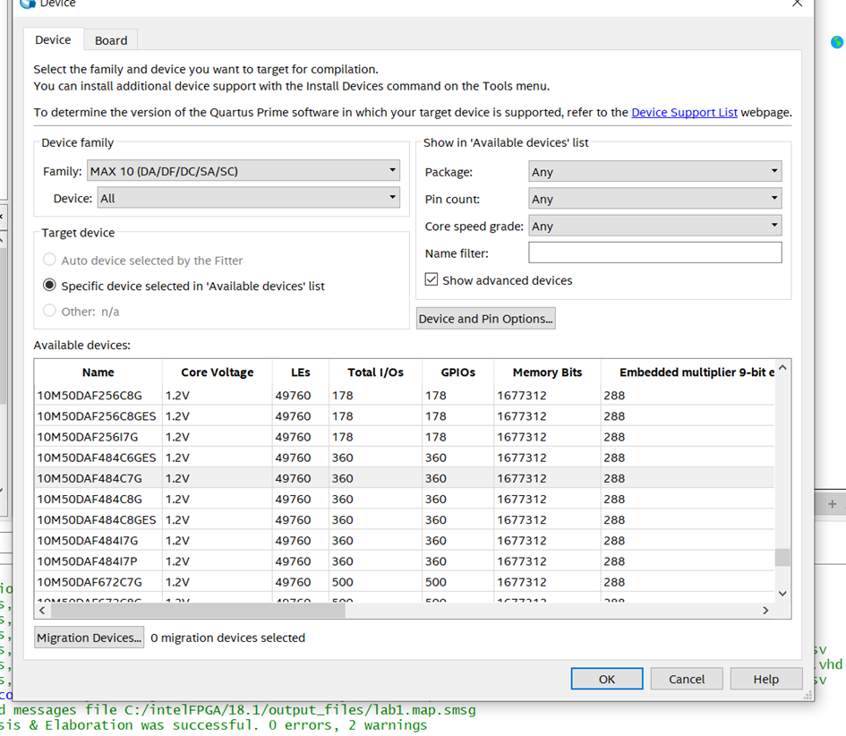
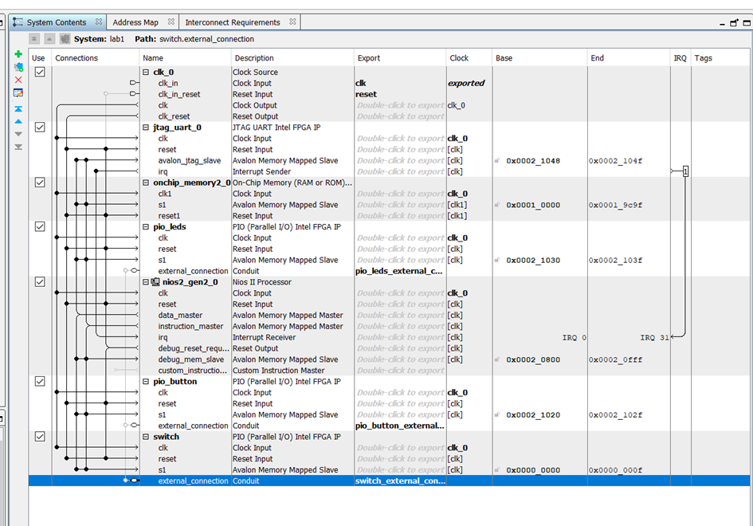
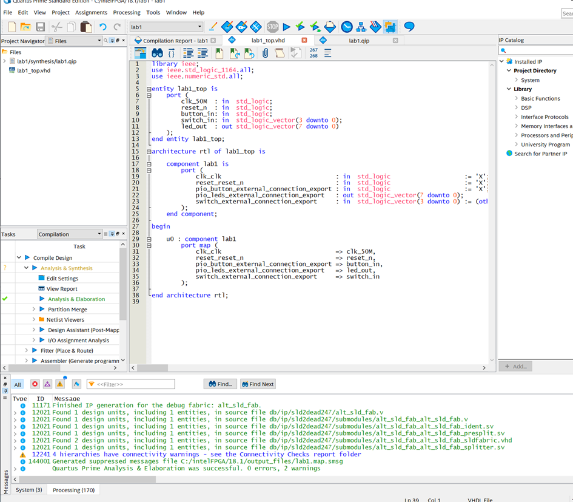
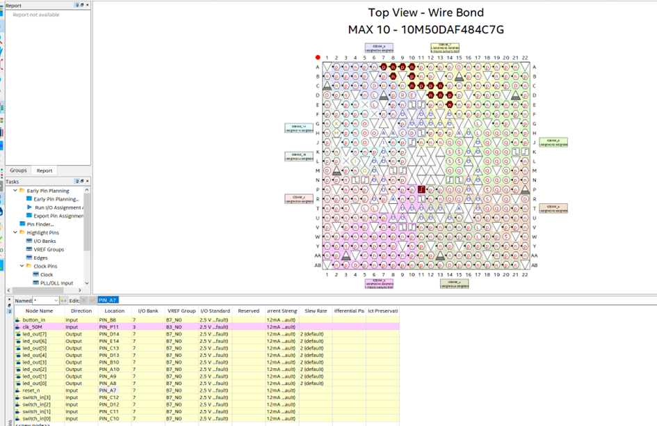
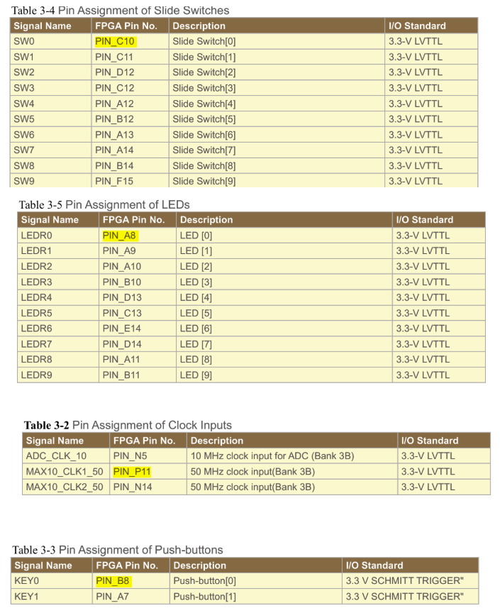
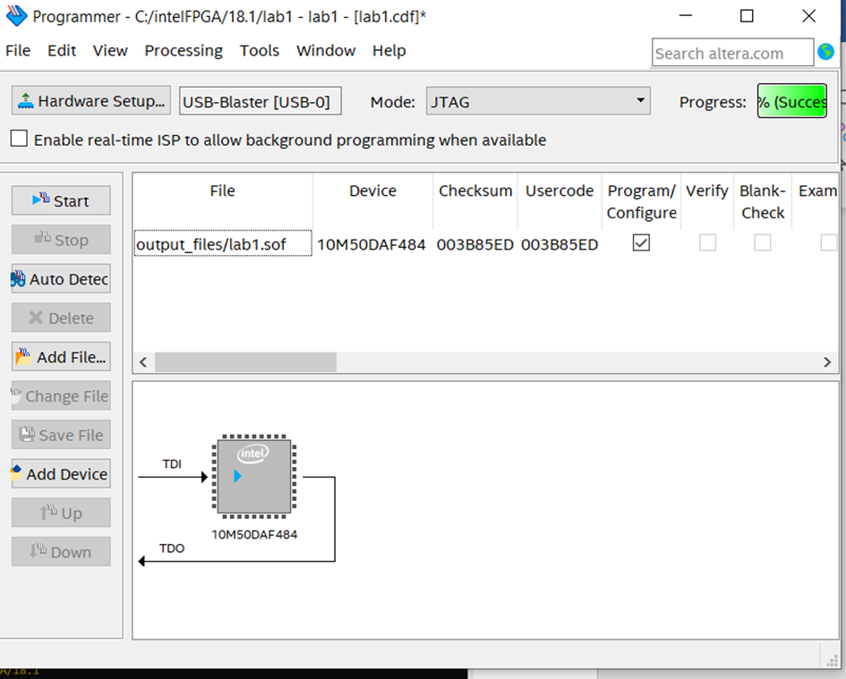

# Lab 1 : Let there be light” - Implement a led chaser 

------

## 1. Créer un système Nios II basique

### 1. Créer un nouveau projet Quartus

- Sélectionner le composant FPGA approprié : MAX 10

  

  Dans le répertoire **ZhengyuWang_lab1**, écrire le code VHDL/Verilog du niveau supérieur.

  Il nous faut un fichier de top-level `lab1_top.vhd` pour instancier le système généré plus tard par Platform Designer (QSYS).

------

### 2. Créer le système Nios II basique dans Platform Designer (QSYS)

1. **Ouvrir Platform Designer (QSYS)** et **créer un nouveau système** nommé `lab1.qsys`.

2. Ajouter un **processeur Nios II** (type Nios II/e).

3. Ajouter une **mémoire On-chip** pour stocker le code et les données (40096 octets).

4. Ajouter un **JTAG UART** pour pouvoir utiliser `nios2-terminal` et faire du débogage/affichage pendant la phase de développement.

5. Ajouter 

   trois PIO (Parallel I/O)

    :

   - **PIO pour LEDs** : en mode sortie (Direction = Output) ; ce signal sera exporté jusqu’au top-level puis connecté aux broches LED du FPGA. Largeur : 8 bits.
   - **PIO pour Button** : en mode entrée (Direction = Input) ; exporté jusqu’au top-level puis connecté à la broche de bouton. Largeur : 1 bit.
   - **PIO pour Switch** : en mode entrée (Direction = Input) ; exporté jusqu’au top-level puis connecté aux commutateurs (switch). Largeur : 4 bits.

------

### 3. Connecter tous les modules

- Utiliser la même source d’horloge (Clock Source) et le même signal de remise à zéro (Reset).
- Le bus Avalon-MM se connecte automatiquement : le Nios II agit comme « Master » et la mémoire On-chip, le JTAG UART, les PIO, etc. comme « Slaves ».

------

### 4. Attribution des adresses

- Dans **System > Assign Base Addresses**, attribuer un espace d’adressage à chaque Slave.

------

### 5. Exporter les signaux PIO (Conduit)

- Exporter le signal PIO pour les LEDs (Conduit Export) afin de les raccorder aux broches LED sur la carte réelle.

- Exporter également les signaux PIO pour le bouton et les switchs (Conduit Export).

  

------

### 6. Générer le système QSYS

- Cliquer sur **Generate**. Vous obtiendrez des fichiers `.qip`, `.sopcinfo`, etc., nécessaires pour l’intégration dans Quartus et la génération de la BSP logicielle.

------

### 7. Instancier la conception QSYS dans le fichier top-level de Quartus

1. Dans le top-level `lab1_top.vhd`, **instancier** le composant généré par QSYS.

2. Exporter les signaux Conduit (PIO) vers les broches du FPGA.

   

3. Dans **Assignments -> Pin Planner**, réaliser le « pin locking » (assignation) des broches du FPGA correspondantes aux LED et aux boutons sur la carte DE10.

   

   Vous pouvez vous référer au document [DE10-Lite_User_Manual.pdf](https://moodle2024.uca.fr/pluginfile.php/653157/mod_resource/content/1/DE10-Lite_User_Manual.pdf) pour connaître l’emplacement des broches sur le DE10-Lite.

   

------

## 4. Compilation matérielle, téléchargement et connexion

1. **Compiler le projet (Compile)** : exécuter Analysis & Synthesis, le Fitter, l’Assembler, etc., et vérifier qu’il n’y a pas d’erreurs.

2. **Programmer le FPGA (Program Device)** : utiliser le fichier `.sof` dans Quartus pour configurer le FPGA.

3. Dans Quartus, via **Tools -> Programmer**, établir la connexion entre la carte de développement et l’ordinateur.

   

------

## 5. Générer le BSP logiciel et écrire l’application

1. **Générer le HAL/BSP**

   Dans le Nios II EDS Shell, utilisez la commande :

   ```
   nios2-bsp hal <out_bsp_dir> <system.sopcinfo>
   ```

   L’outil va automatiquement analyser la description matérielle et générer la BSP.

2. **Générer un Makefile modèle avec Nios EDS**

   ```
   nios2-app-generate-makefile \
       --app-dir <app_dir> \
       --bsp-dir <out_bsp_dir> \
       --elf-name <my_prog.elf> \
       --src-files <fichiers_sources.c>
   ```

3. **Écrire l’application (en C)**

   Les fonctionnalités principales sont :

   1. **Allumer une seule LED** : tester que la sortie du PIO fonctionne correctement.
   2. **Implémenter un « LED chaser » à 8 LEDs** : faire défiler les LED (LED0 à LED7) en boucle.
   3. **Ajouter la gestion du bouton key0 : Play/Pause** : lorsqu’on détecte un appui, on met en pause ou on reprend le défilement des LEDs. On peut implémenter cela par sondage (polling) ou par interruption. (Dans ce lab, on se limite au polling. Les interruptions seront abordées dans le lab3.)
   4. **Gérer le bouton key1 : Reset** : lorsqu’on détecte un appui, on remet la séquence de LEDs à l’état initial (LED0).
   5. **Contrôler la vitesse du « chaser »** (Bonus) : via le switch, on peut régler la vitesse du défilement.

------

### 1) Version 1 : le plus basique, « chaser » de 8 LEDs sans bouton ni switch

- Ne gère pas le bouton (button_in) ni les 4 switchs (switch_in).
- Effet recherché : les LEDs s’allument l’une après l’autre à intervalles réguliers, puis reviennent au début.

```c
/******************************************************************************
 *  Version 1: 8-LED Chaser (no button, no switch)
 ******************************************************************************/
#include <stdio.h>
#include <unistd.h>  // usleep
#include "system.h"
#include "altera_avalon_pio_regs.h"

int main(void) {
    printf("===== Version 1: 8-LED Chaser =====\n");

    // Mode initial : le bit de poids faible est à 1
    unsigned int led_pattern = 0x01;

    while (1) {
        // Écrire la valeur dans le périphérique LED
        IOWR_ALTERA_AVALON_PIO_DATA(PIO_LEDS_BASE, led_pattern);

        // Décalage à gauche
        led_pattern <<= 1;

        // Si on dépasse 0x80, on revient à 0x01
        if (led_pattern == 0x100) {
            led_pattern = 0x01;
        }

        // Pause pour rendre le défilement visible à l’œil (200 ms)
        usleep(200000);
    }
    return 0;
}
```

------

### 2) Version 2 : « chaser » avec fonction Play/Pause via un bouton

- On ajoute le bouton `button_in` (pio_button_external_connection_export).
- Lorsqu’on détecte un appui, on bascule l’état de défilement (marche / pause).
- En général, le bouton est « actif à niveau bas » ou on considère le front descendant comme un appui. Ici, on fait un simple sondage (polling) + détection du changement d’état pour la démonstration.

```c
/******************************************************************************
 *  Version 2: 8-LED Chaser + Play/Pause (Button)
 ******************************************************************************/
#include <stdio.h>
#include <unistd.h>
#include "system.h"
#include "altera_avalon_pio_regs.h"

int main(void) {
    printf("===== Version 2: 8-LED Chaser + Play/Pause =====\n");

    unsigned int led_pattern = 0x01;
    unsigned int running = 1;    // 1 => le chaser tourne, 0 => en pause
    unsigned int old_button = 1; // hypothèse : bouton non pressé => lecture « 1 »

    while (1) {
        // 1) Lire l’état du bouton (bit0)
        unsigned int btn_now = IORD_ALTERA_AVALON_PIO_DATA(PIO_BUTTON_BASE) & 0x1;

        // 2) Vérifier s’il y a un front descendant « 1->0 »
        if ((old_button == 1) && (btn_now == 0)) {
            running = !running;  // basculer l’état
            printf("Button pressed! running=%d\n", running);
        }
        old_button = btn_now;  // mettre à jour l’état précédent

        // 3) Si on est en mode « running », faire défiler les LEDs
        if (running) {
            IOWR_ALTERA_AVALON_PIO_DATA(PIO_LEDS_BASE, led_pattern);
            led_pattern <<= 1;
            if (led_pattern == 0x100) {
                led_pattern = 0x01;
            }
        }

        // 4) Attendre 200 ms (en même temps, ça sert de débogage anti-rebond simplifié)
        usleep(200000);
    }
    return 0;
}
```

------

### 3) Version 3 : « chaser » + Play/Pause + vitesse contrôlée par 4 switchs

- Les 4 switchs (switch_in) contrôlent le temps de pause entre deux déplacements.
- Par exemple, on interprète ces 4 bits comme un nombre de 0 à 15, que l’on transforme en durée de pause plus ou moins longue.
- On conserve la gestion du bouton en Play/Pause.
- On peut aussi envisager d’autres fonctionnalités : inversion du sens de défilement, modes « avance rapide / ralenti », etc.

```c
/******************************************************************************
 *  Version 3 (lightweight): 8-LED Chaser + Button + Switch-based Speed
 *  - Use alt_printf instead of printf
 *  - Potentially smaller footprint with small C library
 ******************************************************************************/
#include <unistd.h>                // usleep
#include <stdint.h>                // uint32_t
#include <sys/alt_stdio.h>         // alt_printf, alt_putstr
#include "system.h"
#include "altera_avalon_pio_regs.h"

static unsigned int calc_delay_us(uint32_t switch_val)
{
    unsigned int base_delay = 50000;  // 50 ms
    unsigned int step       = 30000;  // 30 ms
    if (switch_val > 15) {
        switch_val = 15;
    }
    return base_delay + switch_val * step;
}

int main(void)
{
    alt_printf("=== Light-Weight Version 3: LED Chaser + Button + Switch ===\n");

    unsigned int led_pattern = 0x01;
    unsigned int running     = 1;
    unsigned int old_button  = 1;

    while (1) {
        unsigned int btn_now = IORD_ALTERA_AVALON_PIO_DATA(PIO_BUTTON_BASE) & 0x1;
        if ((old_button == 1) && (btn_now == 0)) {
            running = !running;
            alt_printf("BTN pressed => running=%x\n", running);
        }
        old_button = btn_now;

        unsigned int sw_val = IORD_ALTERA_AVALON_PIO_DATA(SWITCH_BASE) & 0xF;
        unsigned int delay_us = calc_delay_us(sw_val);

        if (running) {
            IOWR_ALTERA_AVALON_PIO_DATA(PIO_LEDS_BASE, led_pattern);

            led_pattern <<= 1;
            if (led_pattern == 0x100) {
                led_pattern = 0x01;
            }
        }

        usleep(delay_us);
    }
    return 0;
}
```

------

### Makefile & Compilation

1. Exécuter la commande `make`.
2. Étant donné la mémoire limitée, on peut utiliser `alt_printf` et la « small C library » pour éviter la surcharge mémoire qu’engendre `printf`.

Ensuite, le programme généré peut être chargé et exécuté dans le softcore FPGA :

```
nios2-download -g -r <my_prog.elf>   // ou make download-elf
```

------

https://zhengyuwang123.github.io/ESN10_VIDEO/


## Conclusion

1. **Ce que nous avons appris**
   - Comment configurer un processeur Nios II dans *Platform Designer (QSYS)* en ajoutant des périphériques (PIO, JTAG UART, mémoire interne) et en attribuant leurs adresses.
   - L’importance de la conception à la fois matérielle (FPGA, signaux d’horloge, entrées/sorties parallèles) et logicielle (programmation C, génération du BSP, utilisation de *Makefile*).
   - Les bases du débogage : programmation du FPGA via Quartus, téléchargement du code (*ELF*) sur le processeur Nios II, et utilisation du *JTAG UART* pour l’affichage et le test.
   - Les contraintes de ressources : avec peu de mémoire, il faut limiter l’usage de fonctions coûteuses comme `printf` et préférer `alt_printf` ou des bibliothèques plus légères.
2. **Progression et résultats**
   - Mise en place d’un chenillard sur 8 LED avec contrôle de pause/redémarrage par bouton, et réglage de la vitesse via des interrupteurs (*switch*).
   - Utilisation du balayage (polling) pour lire l’état des boutons côté logiciel, et configuration flexible des signaux LED/bouton/interrupteur via les PIO côté matériel.
   - Vérification du bon fonctionnement par observation des LED et par l’affichage de messages dans la console (*JTAG UART*).
3. **Problèmes rencontrés**
   - *Attribution incorrecte de broches (Pin Planner)* : il est crucial de consulter la documentation de la carte et de verrouiller les broches correctement pour éviter les erreurs de compilation ou de fonctionnement.
   - *Mémoire limitée* : l’utilisation de fonctions lourdes (ex. `printf`) peut saturer la mémoire interne, obligeant à choisir des alternatives plus légères.
4. **Solutions et pistes d’amélioration**
   - *Planification soignée des ressources* : bien choisir les broches et laisser de la marge pour de futures extensions (GPIO supplémentaires, autres périphériques).
   - *Réduction de la taille du logiciel* : utiliser des options de compilation comme `-Os` et remplacer les fonctions lourdes par des versions plus légères pour optimiser la place en mémoire.

En résumé, cet exercice nous a permis de découvrir toutes les étapes de la conception d’un système Nios II sur FPGA, de l’implémentation matérielle à la programmation logicielle, et de comprendre les limites et optimisations nécessaires dans un environnement embarqué à ressources restreintes.
